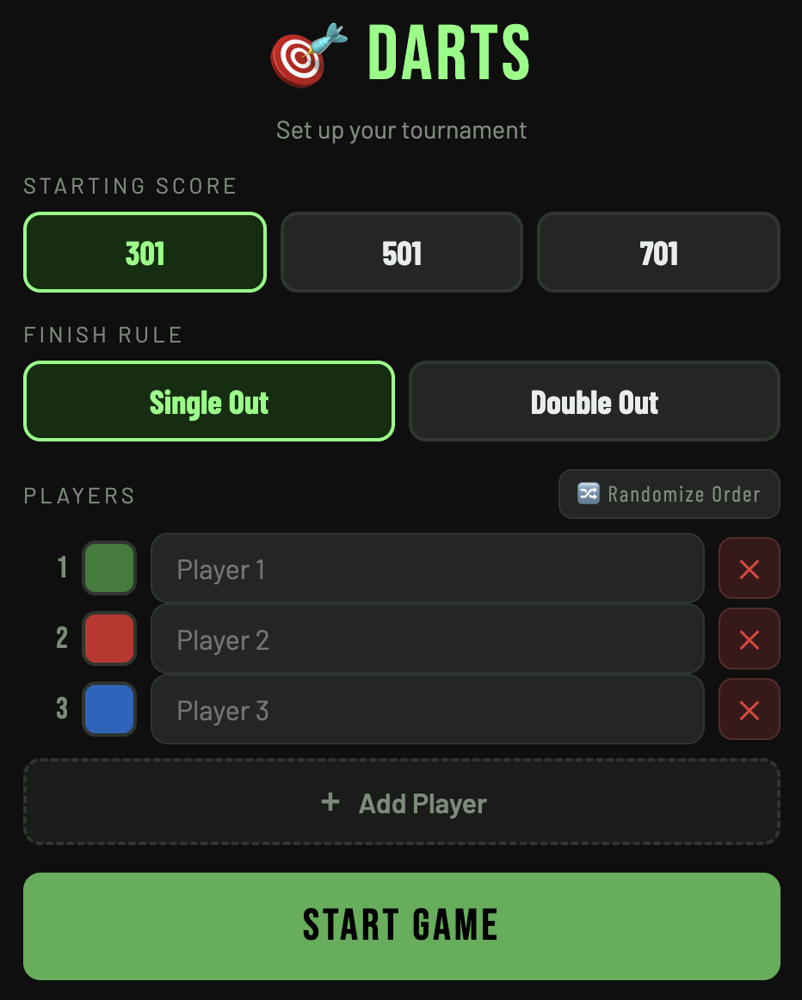
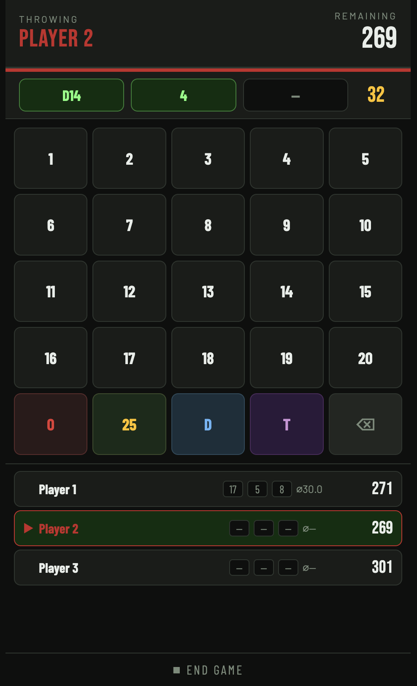
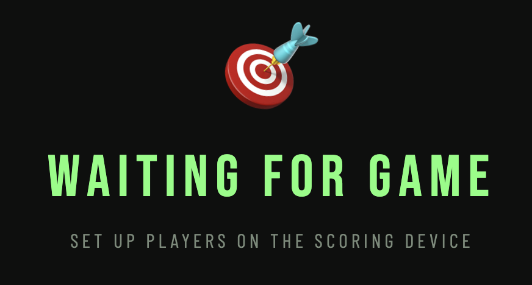
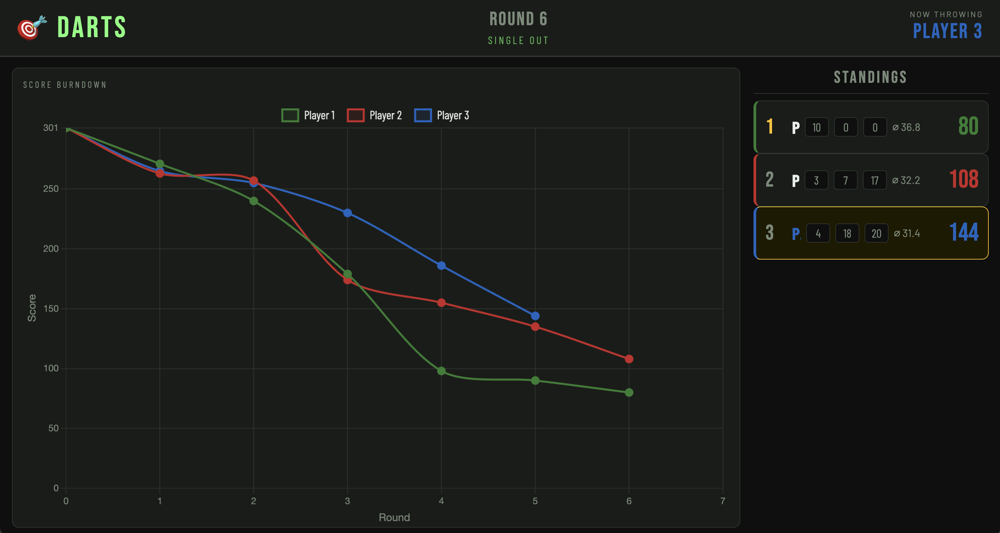

# 🎯 Livingroom Darts

A lightweight darts scoring web app for living room tournaments.  
One phone scores, one laptop/TV displays the live burndown chart.

---

## What it does

- Up to 10 players, configurable starting score (301 / 501 / 701)
- Single Out or Double Out finish rule, selectable on the setup screen
- Dartboard-style numpad — numbers 1–20, Bull, Double, Triple, Miss
- Auto-advances to the next player after 3 darts (no confirm button needed)
- Unlimited undo — ⌫ on empty slots walks back through the entire game history
- **Review mode** — after undo, previous darts shown and locked; ⌫ to correct, ✓ to re-confirm
- Per-player colour coding: picked in setup, shown everywhere in both views
- Live burndown chart on the TV — updates within ~100ms over the same Wi-Fi
- Score counts down **live** as each dart is entered — phone and TV simultaneously
- **Pre-visit score** shown greyed-out next to the live score on the phone — frozen at turn start
- Last 3 individual dart scores shown per player in both views with live updates
- **Bust indicator on TV** — throwing player's row turns red and shows BUST! during the bust delay

---

## Preview






---

## Files

```
.
├── dist/                        ← build output — commit this for GitHub Pages
│   └── index.html               ← single self-contained file, works on file://
├── src/
│   ├── index.html               ← HTML template
│   ├── css/
│   │   ├── base.css             ← variables, reset, shared utilities
│   │   ├── setup.css            ← setup screen styles
│   │   ├── game.css             ← phone/score view styles
│   │   └── tv.css               ← TV display styles
│   └── js/
│       ├── main.js              ← entry point, routing, boot
│       ├── state.js             ← shared state object, pure helpers
│       ├── storage.js           ← localStorage abstraction
│       ├── colors.js            ← palette, colour picker popup
│       ├── setup.js             ← setup screen logic
│       ├── game.js              ← dart pipeline, undo, review mode
│       ├── render-score.js      ← phone view DOM renderers
│       └── render-tv.js         ← TV view DOM renderers + chart
├── docs/
│   ├── GameSetup_view.png
│   ├── InGame_view.png
│   ├── TV_ingame.png
│   └── TV_preview.png
├── package.json
├── vite.config.js
├── LICENSE
├── README.md
├── AGENTS.md
└── Changelog.md
```

---

## Running locally

```bash
npm install
npm run dev
```

Then open in your browser:

| Device | URL |
|--------|-----|
| Phone (scoring) | `http://localhost:5173` |
| TV / laptop (display) | `http://localhost:5173/?view=display` |

The setup screen also has a **📺 Open TV Display** button that opens the display view in a new tab.

**Hard-reload after updating files:** `Cmd+Shift+R` (Mac) · `Ctrl+Shift+R` (Windows)

---

## Building for distribution

```bash
npm run build
```

Produces `dist/index.html` — a single self-contained file with all JS and CSS inlined.  
Works on `file://`, GitHub Pages, or any static host with no server required.

---

## GitHub Pages

1. Run `npm run build`
2. Commit and push `dist/index.html`
3. In repository Settings → Pages, set source to the `dist/` folder

---

## Setup screen

1. Choose **Starting Score**: 301 / 501 / 701
2. Choose **Finish Rule**: Single Out or Double Out
3. Add players — each gets a randomly picked unique colour
4. Tap the **colour swatch** to open the 6×6 colour picker grid:
   - 6 columns: Red · Orange · Green · Cyan · Blue · Purple
   - 5 rows: Pastel → Light → Vivid → Dark → Very Dark
   - Bottom row: neutral greys + bright yellow
   - **?** tile (dark grey, bottom-right) picks a random unused colour
5. Use **🔀 Randomize Order** to shuffle the throwing order
6. Tap **START GAME**

Players, colours, starting score, and finish rule are all remembered when returning from End Game.

---

## Scoring (phone view)

### Numpad layout

```
┌────┬────┬────┬────┬────┐
│  1 │  2 │  3 │  4 │  5 │
├────┼────┼────┼────┼────┤
│  6 │  7 │  8 │  9 │ 10 │
├────┼────┼────┼────┼────┤
│ 11 │ 12 │ 13 │ 14 │ 15 │
├────┼────┼────┼────┼────┤
│ 16 │ 17 │ 18 │ 19 │ 20 │
├────┼────┼────┼────┼────┤
│  O │ 25 │  D │  T │  ⌫ │
└────┴────┴────┴────┴────┘
```

| Button | Meaning |
|--------|---------|
| 1–20 | Single segment |
| O | Miss — 0 points, dart used |
| 25 | Single Bull (25 pts) |
| D | Double modifier — tap D, then a number (D+20 = 40) |
| T | Triple modifier — tap T, then a number (T+20 = 60) |
| D + 25 | Bullseye (50 pts) |
| ⌫ | Delete last entered dart |
| ⌫ on empty | Undo last visit, enter review mode |

D and T act as toggles — tap again to deactivate without entering a dart.

### Turn flow

1. Enter darts one at a time — the preview bar shows each dart and a running visit total
2. The score in the player strip and TV sidebar **counts down live** as each dart is entered
3. After the **3rd dart**, the visit commits automatically (~0.9s delay to show the result)
4. On a **bust**, a red banner flashes and the turn ends without subtracting (~1.5s delay)
5. A player reaching exactly **0** wins immediately — even on dart 1 or 2

### Bust rules

| Rule | Bust condition |
|------|---------------|
| Single Out | Visit total exceeds remaining score |
| Double Out | Visit total exceeds remaining score, **or** leaves exactly 1 remaining |

### Review mode

After pressing ⌫ on empty slots, the previous player's darts are restored and **review mode** activates:

- Blue `REVIEW — EDIT OR CONFIRM` banner appears
- All numpad buttons except ⌫ are **disabled**
- Green **✓ CONFIRM VISIT** button appears

From review mode:
- **✓ CONFIRM VISIT** — re-submits the visit as-is
- **⌫** — removes the last dart and exits review mode. If the removed dart used D or T, that modifier is **pre-activated** automatically

### End Game

**⏹ End Game** returns to setup. Player names and colours are remembered.

---

## TV display (`?view=display`)

| Element | Description |
|---------|-------------|
| **Burndown chart** | One coloured line per player. Only redraws on visit completion — not on individual darts. |
| **Standings sidebar** | Three-column layout: name · last 3 individual dart scores (live, with pop animation on fresh darts) · remaining score (live). |
| **Now Throwing** | Player name in their chosen colour. |
| **Round / Finish Rule** | Round number + Single/Double Out badge. |
| **Waiting overlay** | Shown when no game active. Returns on End Game. |
| **Winner overlay** | Shown on win, cleared on new game. |

Read-only — never writes to storage.

---

## Quick reference

| Action | Method |
|--------|--------|
| Start dev server | `npm run dev` |
| Build for distribution | `npm run build` |
| Open TV display | 📺 button on setup, or add `?view=display` to URL |
| Undo last visit | ⌫ on empty numpad |
| Correct a dart | ⌫ in review mode, re-enter |
| Confirm reviewed visit | ✓ CONFIRM VISIT |
| End game | ⏹ End Game button |
| Hard reload | `Cmd+Shift+R` / `Ctrl+Shift+R` |
